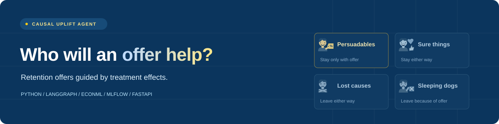
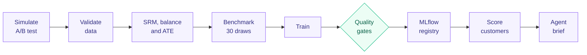
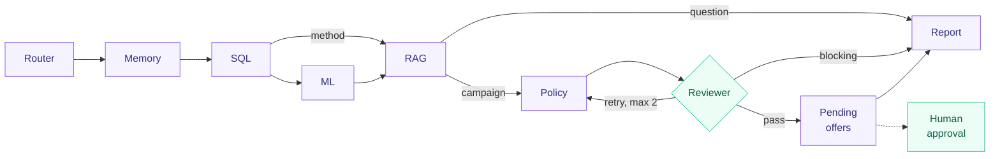

<div align="center">



# Causal Uplift Agent

**Send retention offers to the customers an offer can change, not just the ones most likely to leave.**


[](https://github.com/huilin-zhang/causal_uplift_agent/actions/workflows/ci.yml)

[](LICENSE)

[Quick start](#quick-start) · [Results](#results) · [How it works](#how-it-works) · [Documentation](#documentation) · [Data](#data)

</div>

---

> [!NOTE]
> **Actively being improved.** The code, results, and documentation are still being refined, so details may change.

Most retention teams send offers to the customers most likely to churn. This project sends them to the customers whose decision an offer can actually change. It:

1. estimates each subscriber's **uplift** (how much an offer lowers their churn) from a randomized A/B test,
2. checks that the test is valid,
3. compares uplift models against plain churn-risk ranking, and
4. uses a **LangGraph agent** to turn the results into a reviewed offer list that a person approves.

## Quick start

Requires Python 3.11 or 3.12.

```bash
python -m venv .venv
.venv\Scripts\activate            # macOS/Linux: source .venv/bin/activate
pip install -r requirements.txt
pip install --no-deps -e .
```

Then run:

```bash
python -m pipelines.run_pipeline   # about 7 minutes; set UPLIFT_DRAWS=3 for a 1-minute run
python -m scripts.ask_agent "Plan this month's retention campaign." --trace
uvicorn app.api.main:app --reload  # http://localhost:8000/docs
streamlit run app/ui/streamlit_app.py
```

<details>
<summary><b>🐳 With Docker</b></summary>

```bash
docker compose run --rm pipeline
docker compose up api ui mlflow
```

</details>

## Results

> [!NOTE]
> From one full run (`python -m pipelines.run_pipeline`, 50,000 simulated subscribers, 30 simulation draws, seed 0). The full numbers are in [`artifacts/reports/benchmark_summary.json`](artifacts/reports/benchmark_summary.json).

**🧪 A/B test.** Valid: SRM p = 0.57, largest |SMD| = 0.022. Outreach reduced 30-day churn by an estimated **0.58 pp** (Lin covariate-adjusted, 95% CI 0.05 to 1.11; true simulated effect 0.62 pp). The unadjusted difference in means was 0.76 pp (CI 0.20 to 1.32); Lin is the pre-specified primary estimate.

**🎯 Uplift vs. churn-risk targeting.** In 30 simulated A/B tests with known effects, contacting the top 20% by causal-forest uplift retained a **median 19% more truly incremental customers** than ranking by churn risk (bootstrap 95% CI 9% to 33%; 48.5 vs 40.6 per 3,000 contacts; uplift won in 26 of 30 draws). A single 15,000-row holdout readout could not detect this gain (−2 customers, 95% CI −100 to +87).

<details>
<summary><b>Model comparison and effect recovery</b></summary>

**📊 Model comparison.** On true Qini the X-learner ranked best, then the causal forest and T-learner. Individual effects are only roughly recovered: the causal forest's PEHE (1.61 pp) is just below that of a constant-effect model (1.64 pp).

| Model | True Qini (share of oracle) |
|:--|--:|
| X-learner | 0.55 |
| Causal forest | 0.47 |
| T-learner | 0.46 |
| k-means segments | 0.13 |

</details>

<details>
<summary><b>Offer economics</b></summary>

**💰 Offer list.** On a new simulated cohort the agent proposed 1,239 offers with a true net value of **+$1,638** (model-predicted +$797). Models trained on half the data lost money on average in the benchmark, so this is one example, not a typical result.

</details>

<details>
<summary><b>Non-random assignment</b></summary>

**⚖️ Non-random assignment.** When reps pick who to contact, the naive difference is −11.8 pp. Cross-fitted AIPW gives +0.12 pp (SE 0.35), whose CI covers the true +0.62 pp; weighting brings the largest SMD from 0.78 to 0.04.

</details>

<details>
<summary><b>Public dataset checks</b></summary>

**🌐 Public data.** The estimator selector adapts to each dataset (rare outcomes, unbalanced arms, three arms, 14M rows).

| Dataset | Held-out Qini vs. random |
|:--|:--|
| Hillstrom, women's e-mail | ✅ beats random (causal forest +0.0072, CI +0.0041 to +0.0101) |
| Criteo sample | ➖ borderline |
| Orange telecom churn | ❌ does not beat random |

</details>

## How it works

### Pipeline

Runs weekly via Airflow, or with one command.



The champion alias is updated only when quality gates pass.

### Agent



ML selects estimators and a policy. Policy ranks offers by **net value = uplift × value − cost**. Human approval happens through the API; contacts are logged with a 30-day cooldown.

### Components

| Part | What's in it |
|:--|:--|
| **Learners** | k-means segments, T-learner, X-learner, causal forest (econml), IPW transformed-outcome learner, plus churn-risk and constant-effect baselines |
| **Metrics** | PEHE, observed and true Qini, policy value at 20% coverage, net value, doubly robust validation loss, stratified bootstrap |
| **Agent** | Deterministic by default (no API key needed). An optional Claude provider may rephrase the brief, but any number it adds is rejected. |
| **Serving** | FastAPI, Streamlit dashboard, Docker Compose, MLflow model registry with alias-based rollback, GitHub Actions CI with quality gates and a 9-case agent evaluation |

## Documentation

| Guide | Covers | English |
|:--|:--|:--:|
| Operation manual | install, run, check, deploy | [PDF](docs/manual/operation_manual_en.pdf) |
| Code guide | what each module does and why | [PDF](docs/manual/code_guide_en.pdf) |

Every module names the code-guide section that explains it, and the guide prints code straight from the source files, so the two stay in sync (`python docs/tools/build_manuals.py`).

## Layout

```text
app/
├── causal      experiment checks, learners, metrics, bootstrap, benchmark, selector, policy
├── agents      LangGraph graph and sub-agents (memory, SQL, ML, RAG, policy, reviewer, report)
├── services    SQL access, knowledge retrieval, memory, MLflow registry
├── data        simulation, SQLite store, public dataset loaders
├── api         FastAPI service
└── ui          Streamlit dashboard
pipelines/      pipeline steps, quality gates, agent evaluation
configs/        run settings and simulation parameters
docs/           knowledge cards for retrieval, manuals
infra/          Dockerfile, Airflow DAG
```

## Data

The main results use simulated data. Three public uplift datasets are used to test estimator selection. They are not included in the repository; download them and place them under `data/external/` (details in the operation manual). Each has its own licence.

| Dataset | Rows | Source page | Direct download |
|:--|--:|:--|:--|
| Orange telecom churn uplift (Verhelst et al., 2023) | 11,896 | [GitHub](https://github.com/TheoVerhelst/Churn-Uplift-Dataset-Paper) | [CSV (Dropbox)](https://www.dropbox.com/s/27kyinnh9jcjdcg/churn_uplift_anonymized.csv?dl=0) |
| Hillstrom MineThatData e-mail test (2008) | 64,000 | [MineThatData blog](https://blog.minethatdata.com/2008/03/minethatdata-e-mail-analytics-and-data.html) | [CSV](http://www.minethatdata.com/Kevin_Hillstrom_MineThatData_E-MailAnalytics_DataMiningChallenge_2008.03.20.csv) |
| Criteo Uplift Prediction v2.1 (Diemert et al., 2018; CC BY-NC-SA 4.0) | 13,979,592 | [Criteo AI Lab](https://ailab.criteo.com/criteo-uplift-prediction-dataset/) | link on the source page (311 MB) |

Where each file goes:

```text
data/external/orange/       Orange CSV
data/external/hillstrom/    Hillstrom CSV
Criteo                      python -m scripts.sample_criteo --source <downloaded file>
```

## License

[PolyForm Noncommercial 1.0.0](LICENSE). Free for personal, research, and other noncommercial use; commercial use needs separate permission.
